# ProblemSolver

### New Bulgarian University
### CSCB803 Decision-Making Systems - Final Project

A tool based on the theory of *Multi-Criterial Decision Making (MCDM)*, implementing the *Analytic Hierarchy Process* method. Step-by-step logging can be toggled on from `EDIT > Toggle logs`. This will cause intermediary calculation steps to print out the states of matrices and other such structures into the console output.

A console demo can be found at `MCDM.AnalyticHierarchyProcess.demos main_ahp_laptop.py`. You can run this script as main as long as the working directory remains the project root or you move the script there.

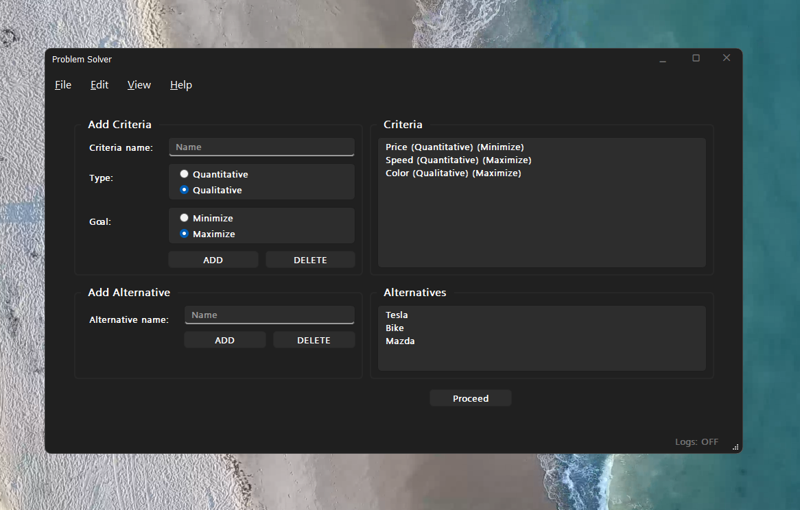

---

### The Process

#### Step 1
Enter criteria and options among which to choose based on the criteria (alternatives).
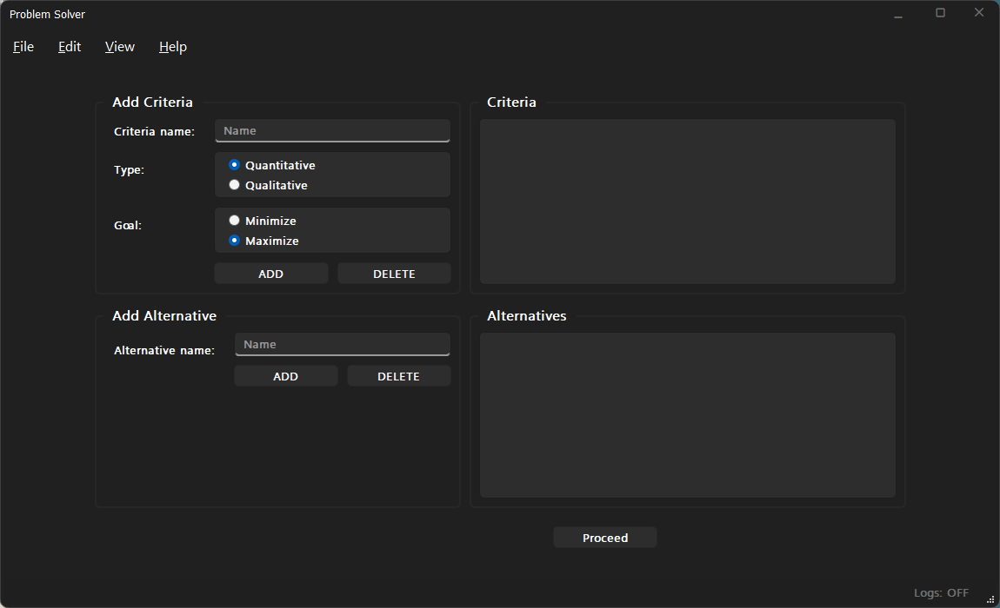
#### Step 2
Enter specific values for each criterion, for each alternative.
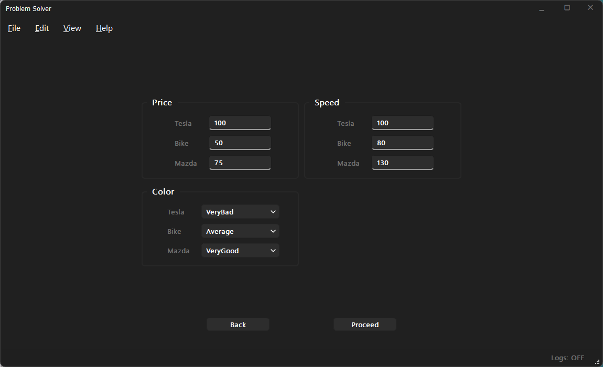
#### Step 3
Evaluate pair-wise importance. Note that ambiguity in these preference ratings will prevent progress (some ambiguity is allowed but not above a given threshold). 
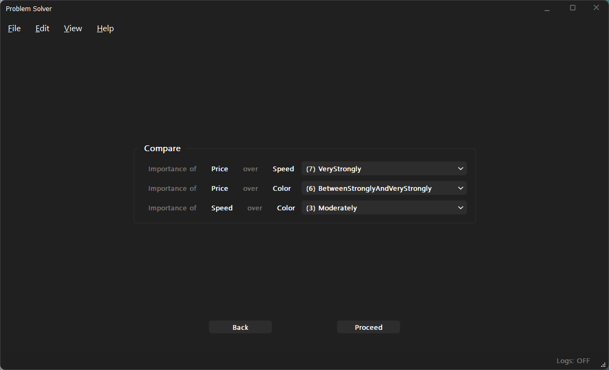
#### Step 4
Review rankings for each alternative and make a decision.
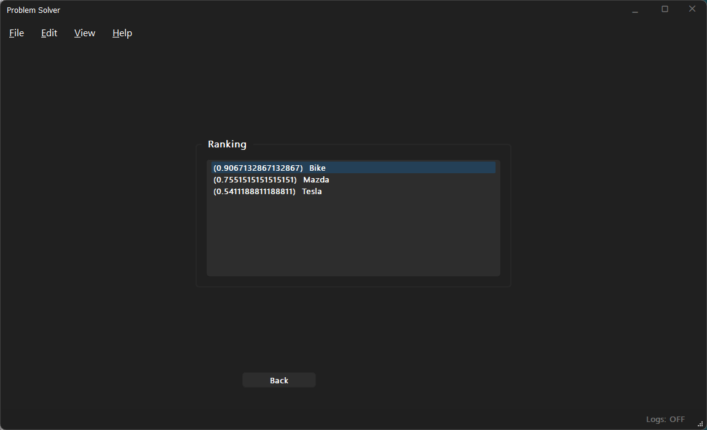

---

### Demo output (`MCDM.AnalyticHierarchyProcess.demos main_ahp_laptop.py`)

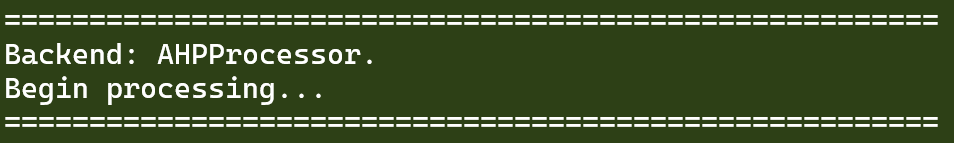
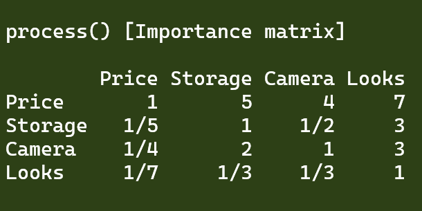
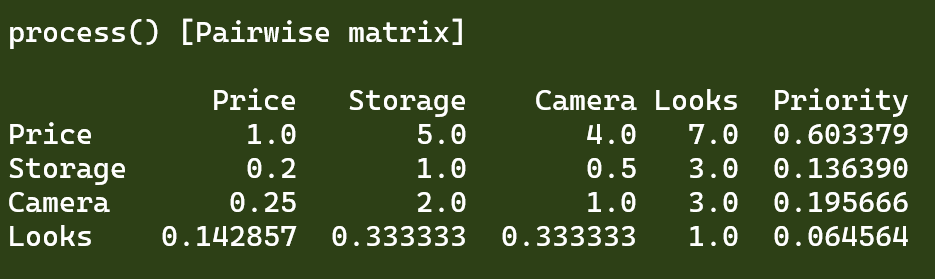
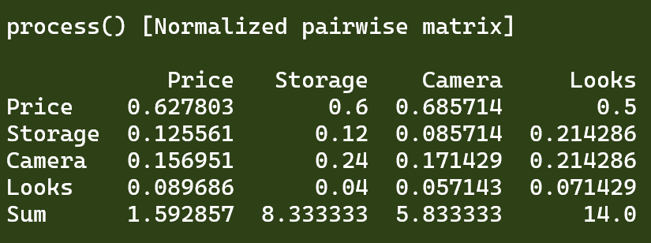
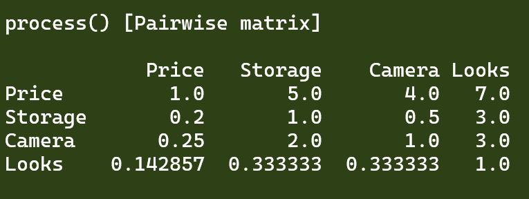
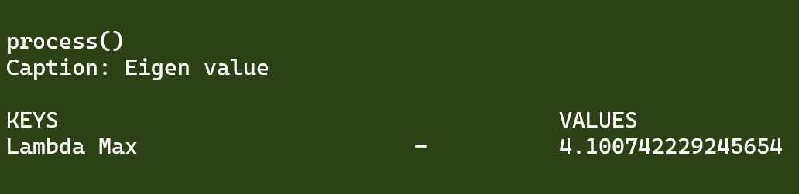
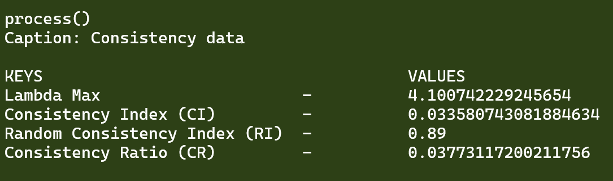
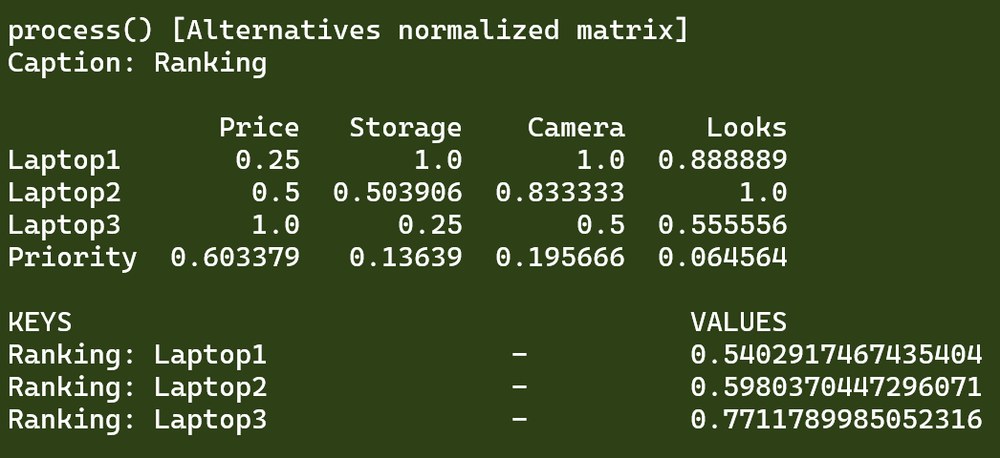
